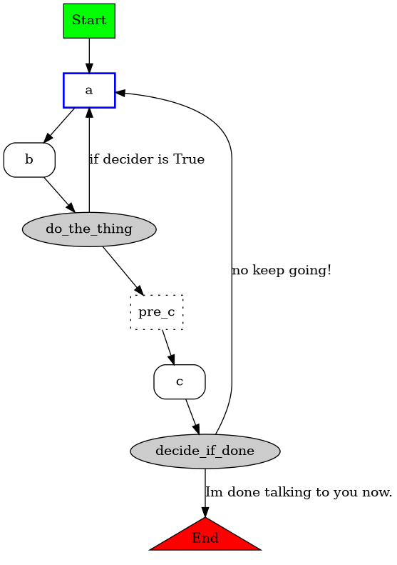

# DynamicStateMachine

## NOTE: This is in beta version. It only has basic tests implemented.

[](https://pypi.org/project/DynamicStateMachine)
[](https://pypi.org/project/DynamicStateMachine)


## Table of Contents

- [Description](#description)
- [Example](#example)
- [Graphing](#graphing)
- [History](#history)
- [Installation](#installation)
- [License](#license)

## Description

This project lets you easily implement, run, and graph a state machine that has complex conditionals. There's other projects similar to this, and honestly, for most things, they're probably better. The ones I looked at (and took inspiration from) are:
* [transitions](https://pypi.org/project/transitions/)
* [python-statemachine](https://pypi.org/project/python-statemachine/)

These are both very good, much more mature projects. I recommend looking at them before turning to this project. What they *don't* do, however (as far as I could tell), is let you easily decide what state to go to next based on parameters given to the advancement function. It's possible in at least one of them (I don't remember which), but it was clunky, frustating, and less elegant that what I was already doing, which was piles of match and if statements.

This library lets you define a bunch of states (with any type of value) and decide which state to go to next, either by always going to a given state, or by calling a `transition method` which returns the state to go to (or another transition method) based on given input. But that all sounds complicated, here's an example:


## Example

You start by putting all your states in a single class which inherits from `States`. Eventually, I'll allow defining states other ways, like via dict, Enum or even list, but this is all it takes for now.

The `States` class will automatically convert all of the values into `State`'s, so when you reference `ExampleStates.a` later, it will be of type `State`, not of type `str`.
```python
class ExampleStates(States):
    a = 'this is a'
    b = 'this is b'
    c = 'this is c'
    # A virtual State
    pre_c = None
```

Virtual states are states that immediately go to the next state, without waiting for a call to `next` to advance it. This can be helpful for sectioning off parts of your program, reusing logic, or just make the generated graph look nicer. If you want to use `None` as a state, you can change the value which defines a virtual state by setting `virtual_value` in the class definition, like this:
```python
class BoolStates(States, virtual_value=...):
    t = True
    f = False
    n = None
    x = ...
```

Next, you define the machine. This inherits from `DynamicStateMachine`, and defines all the side effects of the steps:

```python
class ExampleMachine(DynamicStateMachine):
    def before_a(self):
        print('Now in state a...', end=' ')

    def after_a(self):
        print('done')

    def before_c(self):
        print('Now in state c!')

    def before_pre_c(self):
        print('Now in state pre_c, but not for long...', end=' ')

    def after_pre_c(self):
        print('done')
```
As you can see, before/after methods are optional, they'll only get called if available.

The machine class also defines the side effects of starting and stopping the machine by overriding these methods:

```python
    def on_start(self):
        print('Starting...')

    def on_end(self):
        print('Finished!')
```

The machine class also defines the `transition methods` to decide what state to go to next. `Transition methods` can have side effects as well, but they must return either a `State`, a reference to another `transition method`, which will then get called to decide where to go, or `None`, to indicate the end of the State Machine. This lets you chain complex logic together in a modular way.

`Transition methods` can also return a 2nd value, see [Graphing](#graphing) below.

```python
    def do_the_thing(self, decider=True):
        # Transition methods can have side effects
        print('Deciding...')

        if decider:
            print('Decided on a')
            return ExampleStates.a, 'if decider is True'
        else:
            print('Decided on c')
            return ExampleStates.pre_c

    def decide_if_done(self, done=False):
        print('Deciding if done...')
        if done:
            print('Decided we\'re done')
            return None, 'Im done talking to you now.'
        else:
            print('Decided we\'re not done')
            return ExampleStates.a, 'no keep going!'
```

Lastly, it defines the initial state, the States class we're using, and the transitions that actually build the state machine:

```python
    states = ExampleStates
    initial = ExampleStates.a
    transitions = (
        # Can be either simple transitions, like so
        ExampleStates.a >> ExampleStates.b,
        # ...or transition methods that determine the next state
        ExampleStates.b >> do_the_thing,
        ExampleStates.pre_c >> ExampleStates.c,
        # Transition methods can return a state, another transition method, or None
        ExampleStates.c >> decide_if_done,
    )
```
The transitions are defined by using the `>>` syntax between a `State`, and either another `State`, a `transition method` which defines where to go to next, or None, just like the returns of the `transition methods`. Note that you can also use lambdas in place of full methods, with or without the `self` parameter.

Advacing the machine is done by the `next` method. Any parameters passed to it are fed into the `transition methods`, as well as the before/after methods, if they can handle them. No errors are raised if they can't, it just won't pass the invalid parameters. Similar to the other projects.

```python
if __name__ == "__main__":
    # Initial state is a
    m = ExampleMachine()
    # Starting...
    m.next()      # a -> b
    m.next(False) # b -> c
    m.next(False) # c -> a
    # You can also use the built-in next function
    next(m)       # a -> b
    m.next(True)  # b -> a
    next(m)       # a -> b
    m.next(False) # b -> c
    m.next(True)  # c -> None
    # Finished!
```

## Graphing

Like the other libraries mentioned above, `DynamicStateMachine` can auto-generate it's own graphical representation. It uses `GraphViz` for this. The above example machine looks like this:



The styles of all the different types of nodes can be customized in the DynamicStateMachine.construct_graphviz() function, see the doc string for more details. The names come from either the names or the values (depending on the parameters passed) of the States, the transition names come from the name of the methods, and the edge names come from the returns of the transitions. The construct_graphviz() method parses all the transition methods for return statements, and connects them that way to the nodes they go to. If a string is additionally returned by a transition method (i.e. `return ExampleStates.a, "some explanation"`), the latter is ignored entirely when running, but is parsed by construct_graphviz() and added as the edge text.

# History
I made this project after writing a helper program to help me at my job. I had a series of steps, all very conditional on the input I gave it, and all very conditional on other parameters. I was using match and if statements, which worked surprisingly well, but once it got up to 700+ lines, it became hard to maintain. Auto-generating the graph helped debug, implement, and show my boss how it worked.

-----


## Installation

```console
pip install DynamicStateMachine
```

The import name is the same as the package name:

```python
from DynamicStateMachine import DynamicStateMachine
```

## License

`DynamicStateMachine` is distributed under the terms of the [MIT](https://spdx.org/licenses/MIT.html) license.
